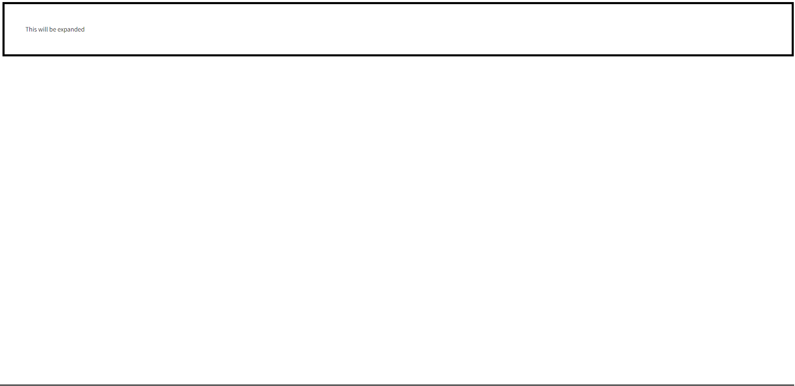
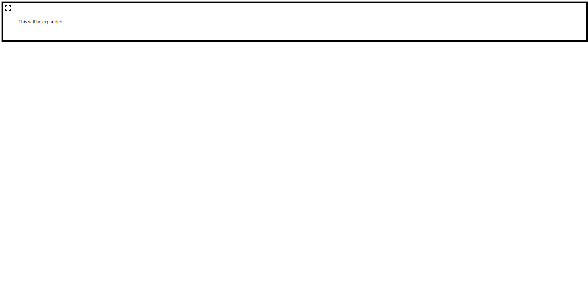
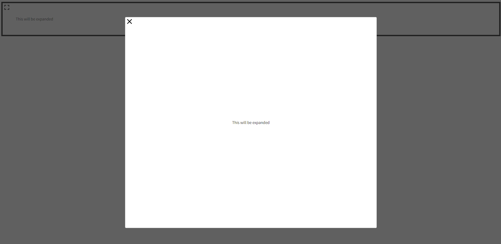

# React Expanded Panel Wrapper
A Panel expender wrapper for react with typescript.

This library uses the [React-Modal npm package](https://www.npmjs.com/package/react-modal), it wrappes any component / data and making it expandable with a modal.

<br>
<br>

To use is, simply wrap the desired content to be expanded with the library's component like so:
```javascript
import React, { CSSProperties } from 'react'
import ExpandedPanel from 'react-expanded-panel-wrapper'

const fatherDivStyle: CSSProperties = {
    position: 'relative',
    padding: '50px',
    border: 'solid 5px black',
}

const App = () => (
    <div style={fatherDivStyle} >
        <ExpandedPanel>
            This will be expanded
        </ExpandedPanel>
    </div>
)

export default App
```
The result will be this:

Before:


After:

On click:


**note!**
=
**You must have the father component / div have a 'position: relative' css attribute for the icon's to always stick to the top left!**